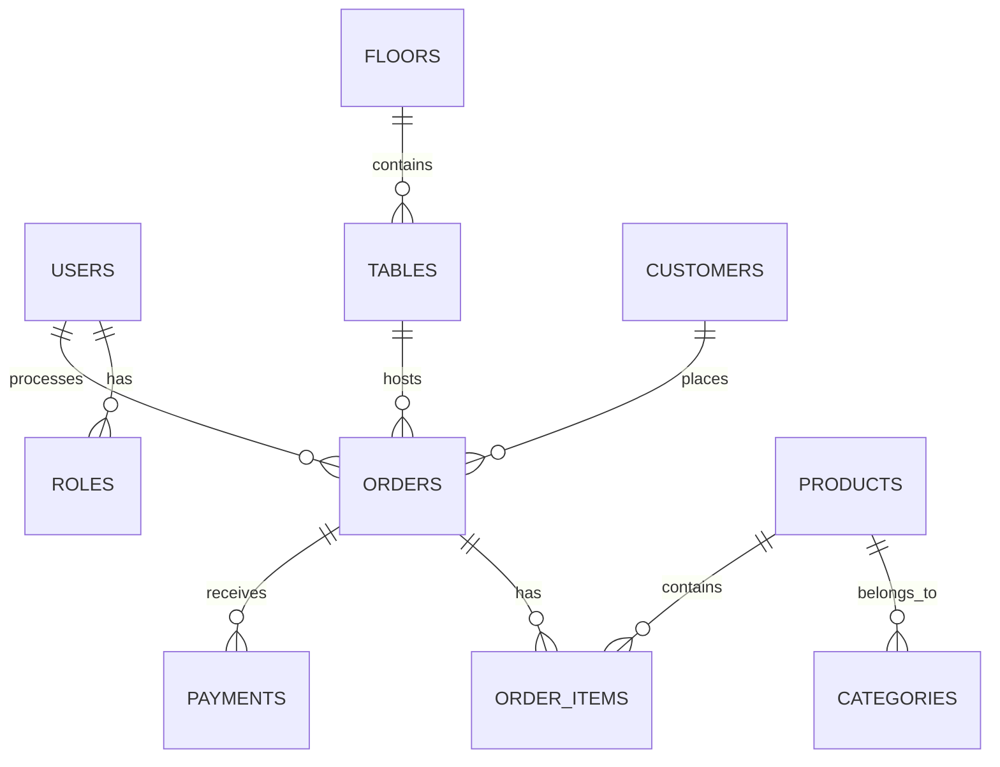

# ER Diagram

```mermaid
erDiagram
    USERS ||--o{ ROLES : has
    USERS ||--o{ ORDERS : processes
    PRODUCTS ||--o{ CATEGORIES : belongs_to
    PRODUCTS ||--o{ ORDER_ITEMS : contains
    FLOORS ||--o{ TABLES : contains
    TABLES ||--o{ ORDERS : hosts
    CUSTOMERS ||--o{ ORDERS : places
    ORDERS ||--o{ ORDER_ITEMS : has
    ORDERS ||--o{ PAYMENTS : receives
```
