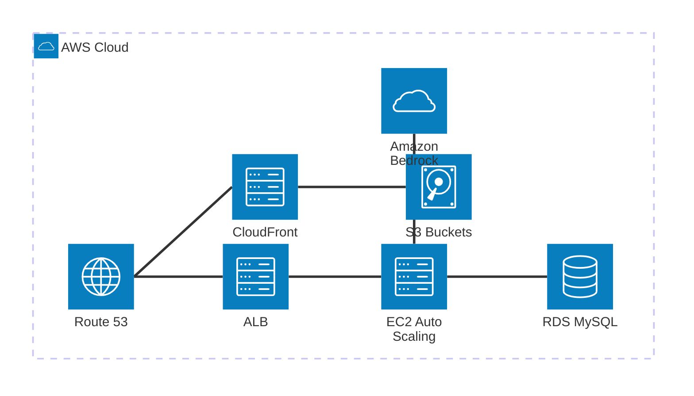

# AWS Architecture Diagram

```mermaid
architecture-beta
    group aws(cloud)[AWS Cloud]
    service r53(internet)[Route 53] in aws
    service cf(server)[CloudFront] in aws
    service s3(disk)[S3 Buckets] in aws
    service alb(server)[ALB] in aws
    service ec2(server)[EC2 Auto Scaling] in aws
    service rds(database)[RDS MySQL] in aws
    service bedrock(cloud)[Amazon Bedrock] in aws
    r53:R -- L:cf
    cf:R -- L:s3
    r53:R -- L:alb
    alb:R -- L:ec2
    ec2:R -- L:rds
    ec2:T -- B:bedrock
```
